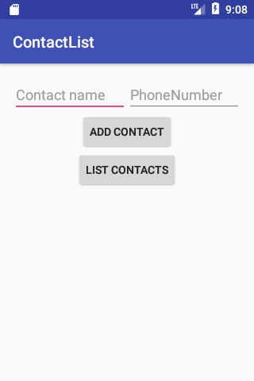
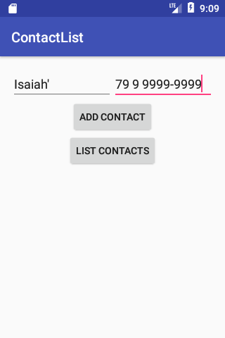
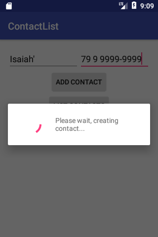
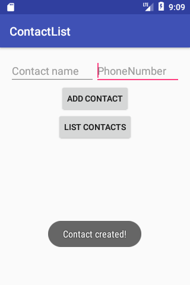
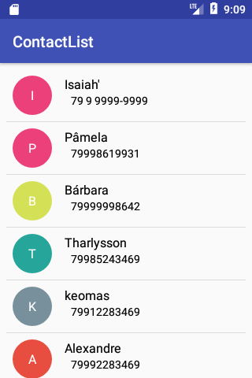
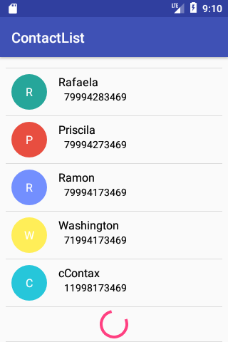

# FirebasePaginator
Simple library to paginate data with Firebase database.

# Sample app
  
 
 

***
## Usage
 1- Add Firebase to your project.
 
 2- Add to your build.gradle level project.
 ```gradle
  allprojects {
    repositories {
        .....
        maven{
            url 'https://dl.bintray.com/isds/FirebasePaginator'
        }
        ....
    }
}
 ```
3- And build.gradle app level.
```gradle
  dependencies{
  ....
      compile 'com.santana.isaias:firebasepaginatorrecycleradapter:1.0'
  ....
  }
```
4- Create your model class, i.e:
```java
public final class Contact
{
    private  String contactName;
    private  String phoneNumber;

    public Contact(String contactName, String phoneNumber)
    {
        this.contactName = contactName;
        this.phoneNumber = phoneNumber;
    }

    public Contact(){}

    public String getContactName() { return contactName; }

    public String getPhoneNumber() { return phoneNumber; }
    
    @Exclude
    public HashMap<String, Object> toMap()
    {
        final HashMap<String, Object> map = new HashMap<>();
        map.put("contactName",contactName);
        map.put("phoneNumber",phoneNumber);

        return map;
    }
}
```

5- Create your ViewHolder.
```java
  
public final class ContactListViewHolder extends RecyclerView.ViewHolder
{
    private TextView label;
    private TextView contactName;
    private TextView contactPhone;

    public ContactListViewHolder(View view)
    {
        super(view);
        label        = (TextView) view.findViewById(R.id.labelFirstLetterRow);
        contactName  = (TextView) view.findViewById(R.id.tvContactNameRow);
        contactPhone = (TextView) view.findViewById(R.id.tvContactPhoneRow);
    }

    public TextView getLabel() { return label; }

    public TextView getContactName() { return contactName; }

    public TextView getContactPhone() { return contactPhone; }
}
```

6- Create your Adpater:

  * make your extends **FirebasePaginatorRecyclerAdapter<YourModel,YourViewHolder>**
  * And override **populateViewHolder(ViewHolderClass yourViewHolder, ModelClass yourModelClass, int positionItemAdapter)**

  
  ```java
     
public final class ContactsListAdapter extends FirebasePaginatorRecyclerAdapter<Contact,ContactListViewHolder>
{
    private final Context context;

    
    
   /**
     * @param modelClass       Your model class.
     * @param layout           The layout resource id to inflate the viewHolder.
     * @param viewHolderClass  The ViewHolder class.
     * @param query            The reference to your data on database. i.e                       
                               FirebaseDatabase.getInstance().getReference(YOUR_NODE). Just add the reference.
    * @param totalDataPerPage the number of data recovered from database. Default limit is 21.
     */
    public ContactsListAdapter(Class<Contact> modelClass,
                               @LayoutRes int layout,
                               Class<ContactListViewHolder> viewHolderClass,
                               Query query,
                               int totalDataPerPage,
                               Context context /* maybe you need*/)
    {
        super(modelClass, layout, viewHolderClass, query, totalDataPerPage);
        this.context = context;
    }    

    @Override
    protected void populateViewHolder(ContactListViewHolder viewHolder,
                                      Contact model,
                                      int position)
    {
        final int color = getRandomMaterialColor("400");

        viewHolder.getLabel().setText(Character.toString(model.getContactName().toUpperCase().charAt(0)));
        DrawableCompat.setTint(DrawableCompat.wrap(viewHolder.getLabel().getBackground()),color);
        viewHolder.getContactName().setText(model.getContactName());
        viewHolder.getContactPhone().setText(model.getPhoneNumber());
    }
    
    ...
}      
  ```
7 - Attach in the recyclerview.
 
 ```java
   @Override
    protected void onCreate(Bundle savedInstanceState)
    {
        super.onCreate(savedInstanceState);
        setContentView(R.layout.activity_contact_list);

        findViewById(R.id.my_progress_bar).setVisibility(View.VISIBLE);
        
        final DatabaseReference reference = FirebaseDatabase.getInstance()
                                                            .getReference()
                                                            .child(YOUR_NODE_CONTACTS); //i.e contactList.

        final ContactsListAdapter contactsListAdapter = new ContactsListAdapter(Contact.class,
                R.layout.row_contact,
                ContactListViewHolder.class,
                reference,
                10/*totalDataPerPage*/,
                context);

        final RecyclerView recyclerView = (RecyclerView) findViewById(R.id.my_recycler_view);
        final LinearLayoutManager llm =
                                  new LinearLayoutManager(this,LinearLayoutManager.VERTICAL,false);


        recyclerView.setLayoutManager(llm);
        recyclerView.addItemDecoration(new DividerItemDecoration(this,DividerItemDecoration.VERTICAL));
        recyclerView.setHasFixedSize(false);
        recyclerView.setAdapter(contactsListAdapter);
        recyclerView.addOnScrollListener(new RecyclerView.OnScrollListener() {
            @Override
            public void onScrolled(RecyclerView recyclerView, int dx, int dy)
            {
                super.onScrolled(recyclerView, dx, dy);

                final int totalItemCount =  llm.getItemCount();
                final int lastVisibleItem = llm.findLastCompletelyVisibleItemPosition();


                if(!contactsListAdapter.isLoading() && totalItemCount <= (lastVisibleItem + 2))
                {
                    contactsListAdapter.loadMore();
                }
            }
        });
    }
 ```
